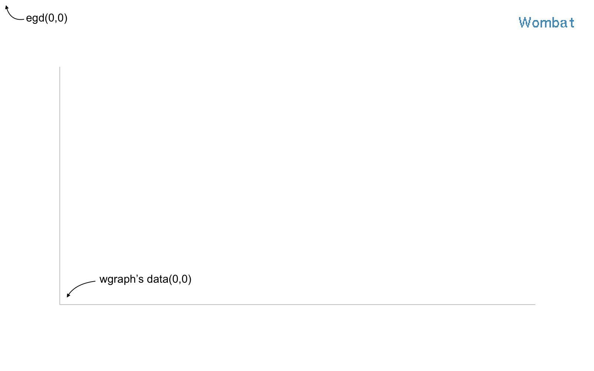

wgraph
=====

This can draw colorful lines. Thanks for egd and eplot.

 Graphs:  
    

 Just one line:  
    

  

 Basic image:  
    

  

 just_create.png  
    

 points.png  
    

Build
-----

    $ rebar3 compile
