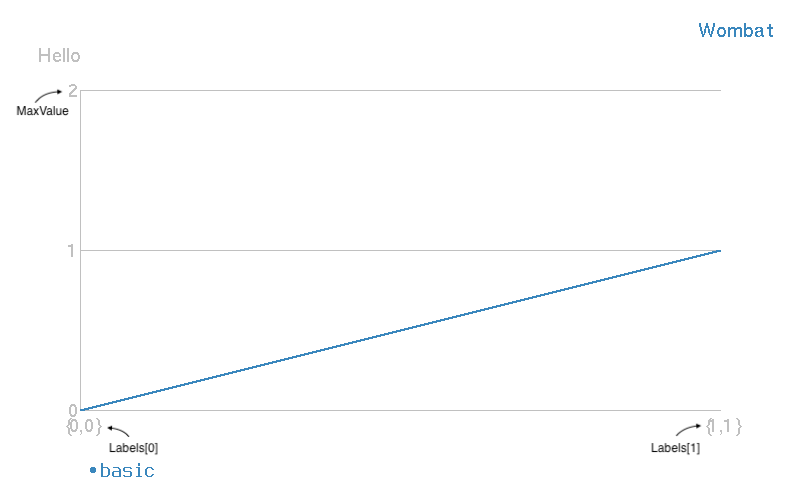
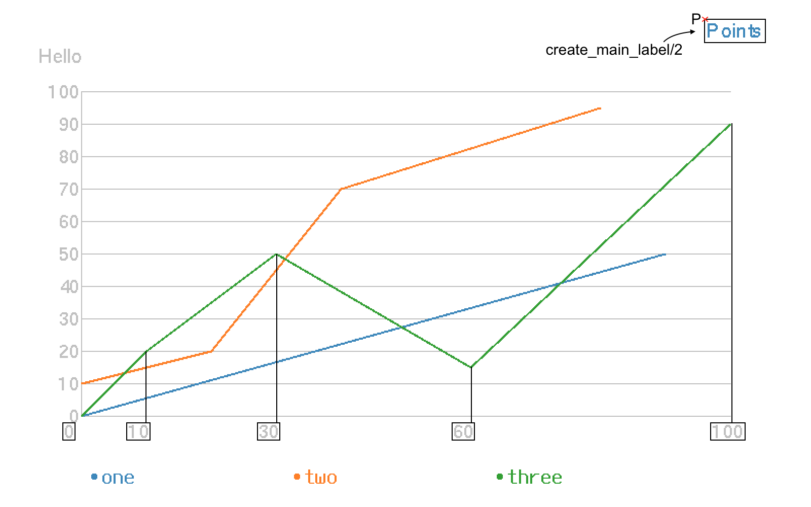

wgraph
=====

This can draw colorful line. Thank for egd and eplot.

 Basic image:
    

 Just one line:
    

    

 Graphs:
    

 just_create.png
    

 points.png
    

Build
-----

    $ rebar3 compile
